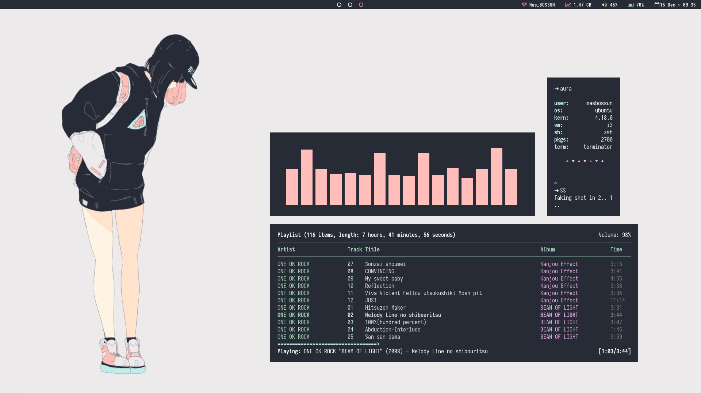

Photo by [Sai Kiran Anagani](https://unsplash.com/@_imkiran) on [Unsplash](https://unsplash.com/)

On this post i will tell you about my environment and experience of using linux system operations. Below is list of the content

1. [Experience Using Linux](#experience-using-linux)
2. [My Linux Environment](#my-linux-environment)
   - [Desktop Environment](#desktop-environment)
   - [Terminal](#terminal)
   - [Development Apps](#development-apps)
   - [File Manager](#file-manager)
   - [Wallpapers](#wallpapers)
   - [Games](#games)

## <a name="experience-using-linux">Experience Using Linux</a>

I have been using linux as my daily basis operating system for about 6 months from 2018. Actually i used to use windows-based operating system for about 8 years, from **windows xp** to **seven** to **8** to **8.1** and lastly **windows 10**. But in the middle year of 2016 i learned another operating system with \*NIX based kernel called Linux. My first linux distro that i dual-booted to my disk is Ubuntu (_i forgot the version of it_). Since then i get used to using terminal and get rid all of the GUI-things and change to CLI and i feel more powerful at that time, and that is true because i am feeling just like hacker (_LOL, all geeky kid dreams_).

But then the problems is come, first, a lot of features of Windows are not available or not so powerful on Linux such as **Microsoft Office**. Second my laptop disk is cannot accommodate any other data because i use separate disk partition for linux. third, at that time i feel like i not so needed the linux operation as my daily OS. So i deleted all my disk's partition with linux os inside.

Back then when i started studying in university, i learnt linux again at 4th semester in Network Security Class. at that class we use linux as operating system to protect the network and so on. I felt like i getting comfortable again with linux, so i was install it again on my disk. After a while i find and try many distros to fit my needs and my laptop. I have try [arch](https://archlinux.org/), [manjaro](https://manjaro.org/), [centos](https://centos.org/), [ubuntu](https://ubuntu.com/), and many other arch-based distros. I tried many distro because there is always a problem to come such as the EFI issue, kernel issue, etc. Then until i found that debian-based ubuntu is more stable for my requirements. So i installed ubuntu at version 18.10 on my disks. In a month of usage, i have spent a lot of time to use this distro than my windows OS. I started to install all my environment again, i installed all my development apps again, and use it in my daily basis. On another month i decide to remove all my disk's data and just install one operating system that i need, and i found the [Pop_OS!](https://system76.com/pop) the ubuntu-based distro for development. I download it and install to my disk as a primary and the only one operating system.

In my journey to find the best distro i always filled all my installed linux with the same environment. So i experienced with many plugins or theme-related apps on many distro. Right now i am using the Pop_OS! from [system76](https://system76.com), the official website says that the OS is focused for a developers. When i use it i find the feeling is the same when i use ubuntu, until now i can't find what is the different between them. They make some [article](https://pop.system76.com/docs/difference-between-pop-ubuntu/) to show the different between their OS and Ubuntu, but in my usage i can't see any different. But because it stable and fit my needs, i decide to get along with this distro.

## <a name="my-linux-environment">My Linux Environment</a>

My linux environment is basically a lot of themed-related apps, because i find customizing the operating system just like what i want can makes me happy. I change all the aspects in my linux to be different. I subscribe to popular \*NIX Desktop Art in reddit called [/r/unixporn](https://reddit.com/r/unixporn) to find the inspiration about the theme and apps to theming the desktop of my linux. I have tried to use many Desktop Environment like [GNOME](https://www.gnome.org/), [OpenBox](http://openbox.org/wiki/Main_Page), [i3-gaps](https://github.com/Airblader/i3), [awesome](https://awesomewm.org/), etc. But i found the i3-gaps is very good for theming, after i use for development-usage i found not so comfortable with it and rather to switch back to GNOME.

#### <a name="desktop-environment">Desktop Environment</a>

In linux there is a lot of desktop types. We called it DE or **Desktop Environment**. Maybe you have known about **GNOME** or **Unity** in ubuntu or **Cinnamon** in Linux Mint. But there is plenty of DE's that have different functionality. The main different of this DE's is the appearance, there is plenty of DE that has an ugly interface in first installation, but when it comes to the right hand, the DE will looks 180&#176; more beautiful than first install. So the DE here is more personal in case of appearance.

My choice of Desktop Environment right now is GNOME, i use it because of it simplicity when it comes to productivity aspects. GNOME are not so powerful if we talk about the appearance customization, but if you want, you can totally make GNOME more like yours. I have already use any other DE's before, like **openbox** i like when i change the border style and the menu style, and i have use **i3 / i3-block**, i like when i change the color style, the bar (i am using [polybar]()), the terminal apps (like [ncmpcpp](https://rybczak.net/ncmpcpp/), [cava](https://github.com/karlstav/cava), [mpsyt](https://github.com/mps-youtube/mps-youtube), [ranger](https://github.com/ranger/ranger)) etc. if you want, you can lokk at my [repo](https://github.com/masbossun/almighty-dotfiles) to see my customization scripts.

Back to my GNOME, i am use **Gnome-Tweak-Tool** to change all the aspects on my Desktop. below is the specification of my GNOME Desktop.

- Gnome-shell : [Mojave Dark](https://www.gnome-look.org/p/1215571/)
- GTK Theme : [Sierra Dark Solid]()
- Cursor : [Pop](#)
- Icon Theme : [Numix Circle](https://github.com/numixproject/numix-icon-theme-circle)
- Gnome Extensions :
  - [AlternateTab](https://extensions.gnome.org/extension/15/alternatetab/)
  - [Appfolders Management extension](https://extensions.gnome.org/extension/1217/appfolders-manager/)
  - [Azan Islamic Prayer Times](https://extensions.gnome.org/extension/1344/azan/)
  - [BLYR](https://extensions.gnome.org/extension/1251/blyr/)
  - [Caffeine](https://extensions.gnome.org/extension/517/caffeine/)
  - [Dash to Dock](https://extensions.gnome.org/extension/307/dash-to-dock/)
  - [Do not Disturb](https://extensions.gnome.org/extension/1480/do-not-disturb/)
  - [Full Battery Indicator](https://extensions.gnome.org/extension/1466/full-battery-indicator/)
  - [Impatience](https://extensions.gnome.org/extension/277/impatience/)
  - [Mailnag](https://extensions.gnome.org/extension/886/mailnag/)
  - [OpenWeather](https://extensions.gnome.org/extension/750/openweather/)
  - [User Themes](https://extensions.gnome.org/extension/19/user-themes/)

#### <a name="terminal">Terminal</a>

For terminal i am currently using **[Terminator](https://gnometerminator.blogspot.com/p/introduction.html)**, terminator is terminal that have ability to grid many terminal in one window. But i am not really using that function a lot, because i rather to use different window for different terminal console. Inside my terminal i am using **[ZSH](http://www.zsh.org/)** as my shell console, i choose zsh because there is a lot of plugins terminal more comfy to use. There is a plugins such as **[oh-my-zsh](https://ohmyz.sh/)** to add some aesthetic and convenience to my terminal. The other plugins i use is **[zsh-syntax-highlighting](https://github.com/zsh-users/zsh-syntax-highlighting)** to add more colors on my terminal.
